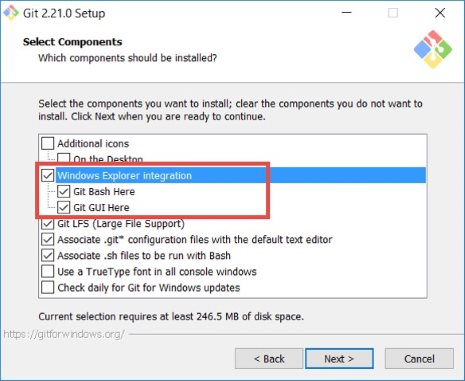

# Installation von Git

Du kannst Git über folgende Links herunterladen: 

- [Windows](https://git-scm.com/download/win)
- [Mac OS](https://git-scm.com/download/mac)
- [Linux](https://git-scm.com/download/linux)

Wenn der Download fertig ist, startest du die Installation. 

Falls du Git auf einem Windows Rechner installierst, aktivierst du am besten die _Windows Explorer Integration_ Option. Dies wird dir die Arbeit mit Git erleichtern. 




## Konfiguration 

Nachdem du Git installiert hast, solltest du als erstes deinen Namen und deine E-Mail Adresse in Git konfigurieren. Das ist wichtig, weil Git diese Information bei jeden Commit, der von dir angelegt wird, in der Historie hinterlegt. Damit ist später ersichtlicht, wer welche Änderungen vorgenommen hat. 

Starte die Git Bash und führe folgende Befehle aus: 

```
$ git config --global user.name "Peter Muster" 
$ git config --global user.email "peter@muster.ch" 
```

Hinweis: 

Diese Konfiguration brauchst du nur einmal vorzunehmen. Da du die Option --global verwendest, gilt das dann für all deine Projekte. Wenn du für ein spezielles Projekt einen anderen Namen oder eine andere E-Mail Adresse verwenden möchtest, kannst du den Befehl ohne die --global Option innerhalb des betreffenden Projektes ausführen.

### Einstellungen überprüfen 

Alle Einstellungen anzeigen, die Git an dieser Stelle, z.B. innerhalb eines bestimmten Projekts, bekannt sind: 

```
$ git config --list 
```