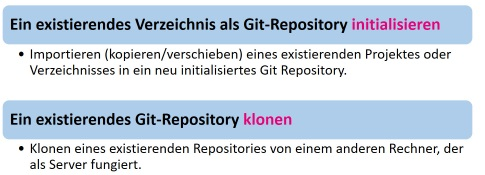

# Git Basics

Los geht's! Du wirst nun deine ersten Schritte mit Git machen und die ersten Git-Befehle kennenlernen. 

## Lokales Git-Repository anlegen 

Es gibt zwei Möglichkzeiten, ein Git-Repository auf deinem Rechner anzulegen. 



### Ein neues Repository initialisieren

Um das Verzeichnis zu initialisieren in das betreffende Verzeichnis wechseln und folgenden Befehl ausführen: 

```
$ git init
```

Dateien zum Repo hinzufügen: 

```
$ git add *.* 
$ git commit -m
```

### Ein bestehendes Repository klonen

Um ein Verzeichnis zu klonen in das Verzeichnis wechseln wohin geklont werden soll und folgenden Befehl ausführen:  

```
$ git clone [url] [zielverzeichnis]
```

Dateien zum Repo hinzufügen: 

```
$ git add *.* 
$ git commit -m
```

## Mit Dateien arbeiten

Zustand der Dateien im lokalen Repository prüfen: ```$ git status```


Untracked files: 

- to track: ```$ git add {Dateiname}``` 

Changed files not staged for commit:

- to stage: ```$ git add {Dateiname}``` 


Changed files to be commited:

- to commit: ```$ git commit –m "commit message" {Dateiname}``` 

### Dateien ignorieren 

Verwende eine Datei mit Namen **_.gitignore_** um Dateien von der Verwaltung durch Git auszuschliessen: 

- im Root des Projektverzeichinsses  
- leere Zeilen oder Zeilen, die mit # beginnen, werden ignoriert 
- Standard glob Muster funktionieren *
- Muster mit einem Schrägstrich (/) abschliessen, um ein Verzeichnis zu deklarieren 
. Muster negieren, indem ein Ausrufezeichen (!) vorangestellt wird 

Vereinfachte reguläre Ausdrücke für Glob-Muster: 
   - \* = kein oder mehrere Zeichen  
   - [abc] 	= eines der angegebenen Zeichen (a, b oder c)
   - ?	= beliebiges einzelnes Zeichen 

Siehe auch: [https://git-scm.com/docs/gitignore](https://git-scm.com/docs/gitignore)

Beispiel:

```
# Created by https://www.gitignore.io/api/visualstudio
# Edit at https://www.gitignore.io/?templates=visualstudio

### VisualStudio ###
## Ignore Visual Studio temporary files, build results, and
## files generated by popular Visual Studio add-ons.
##
## Get latest from https://github.com/github/gitignore/blob/master/VisualStudio.gitignore

# User-specific files
*.rsuser
*.suo
*.user
*.userosscache
*.sln.docstates

# Build results
[Dd]ebug/
[Dd]ebugPublic/
[Rr]elease/
[Rr]eleases/
x64/
x86/
[Aa][Rr][Mm]/
[Aa][Rr][Mm]64/
bld/
[Bb]in/
[Oo]bj/
[Ll]og/
```
Komplett: [https://www.gitignore.io/api/visualstudio](https://www.gitignore.io/api/visualstudio)

## Aenderungen durchsehen 

Wenn du wissen willst, was sich geändert hat: ```$ git diff```

## Mit externen Repositories arbeiten 

Um zusammen mit anderen an einem Git Projekt zu arbeiten, musst du ein paar Dinge über Remote Repositories wissen. Ein Remote Repository ist eine Version deines Projekts, die auf im Internet oder in einem Netzwark gehostet wird. Für ein Remote Respository  hast du entweder read-only or read/write Rechte. 

Um mit anderen zusammenzuarbeiten, wirst du einerseits deine Änderungen ins Remote-Repo übertragen  (```push```)  und andererseits die Änderungen deiner Team-Kollegen von dort übernehmen (```pull```) wollen. 

Wenn Du wissen willst, welche externen Server (URL) du für dein lokales Projekt konfiguriert hast: ```$ git remote -v```

Änderungen aus dem Remote-Repositoy herunterladen und mit deinem lokalen Stand zusammenführen: ```$ git pull origin master```

Änderungen in ein Remote-Repository hochladen: ```$ git push origin master```

***Hinweis:*** Es gilt pull vor push, falls lokal etwas nicht aktuell ist.